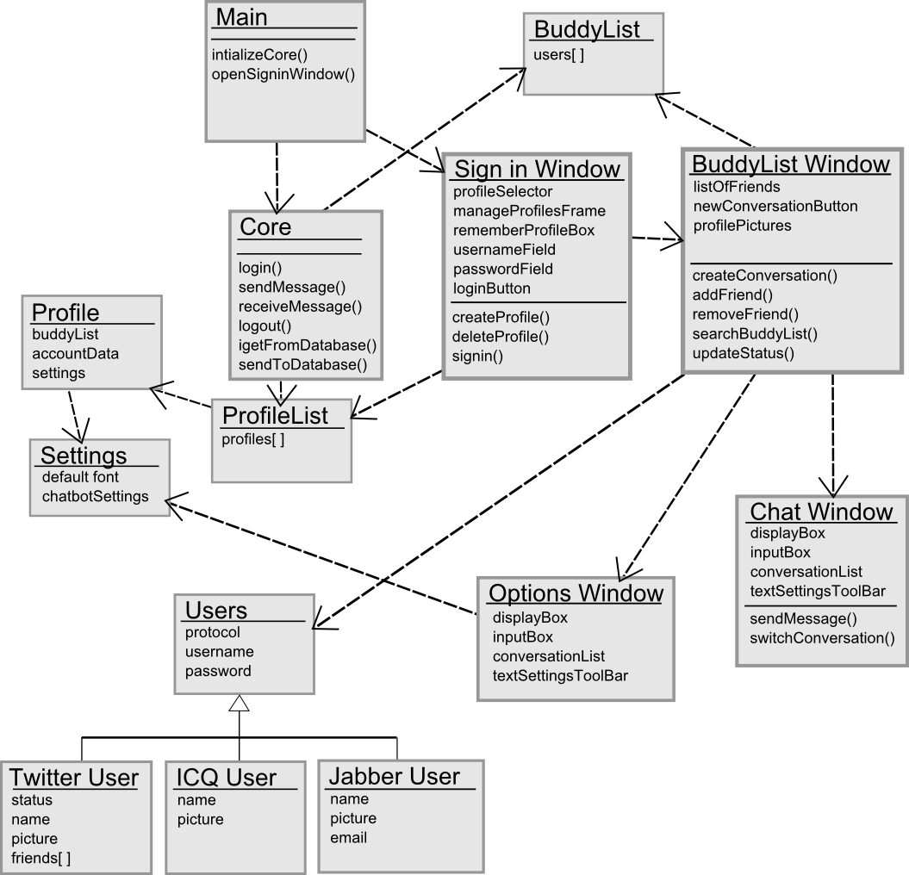
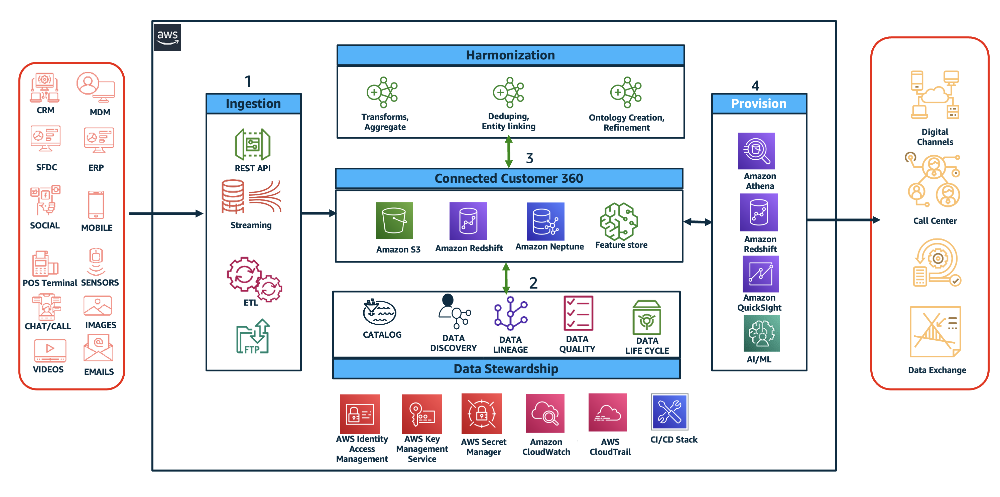

    <h1>Class Diagram</h1>
    

## Explain in brief what this image is about

This image shows a class diagram depicting the structure of a chat application. It showcases different classes like Main, Core, Profile, Settings, Users, BuddyList, BuddyList Window, Sign in Window, ProfileList, Chat Window, and Options Window. Each class has specific attributes and methods to manage user profiles, buddy lists, chats, settings, and user authentication. The diagram highlights the relationships between these classes, indicating how they interact and communicate with each other.  The diagram also shows the inheritance relationships, for example, Twitter User, ICQ User, and Jabber User all inherit from the Users class.  Overall, this diagram provides a visual representation of the application's architecture and how its various components work together. 

## Convert this diagram into text explaining each class and the linkages between classes

The diagram depicts a system with the following classes:

**Main:** This is the starting point of the application, responsible for initializing the core and opening the sign-in window.

**Sign in Window:** This window handles user authentication with features like:
- **profileSelector:** A dropdown for choosing an existing profile.
- **manageProfilesFrame:** A window for creating or managing profiles.
- **rememberProfileBox:** A checkbox for remembering the current profile.
- **usernameField:**  A field for entering the username.
- **passwordField:** A field for entering the password.
- **loginButton:** A button to initiate the login process.
- **createProfile():** A function to create a new user profile.
- **deleteProfile():** A function to delete an existing profile.
- **signin():** A function to authenticate the user.

**BuddyList:** This class represents a list of users, potentially friends, with a field for storing their usernames.

**BuddyList Window:** This window displays a list of buddies with features like:
- **listOfFriends:** A list displaying the names of the buddies.
- **newConversationButton:** A button to initiate a new chat with a buddy.
- **profilePictures:**  Displaying profile images of buddies.
- **createConversation():** A function for creating a new chat with a buddy.
- **addFriend():**  A function to add a new buddy to the list.
- **removeFriend():** A function to remove a buddy from the list.
- **searchBuddyList():** A function to search for a specific buddy.
- **updateStatus():** A function to update the buddy's status (e.g., online, offline).

**Chat Window:** This window displays the chat interface with features like:
- **displayBox:** A box displaying the chat messages.
- **inputBox:** A field to type new messages.
- **conversationList:** A list of previous chat conversations.
- **textSettingsToolBar:** A toolbar for customizing the chat display.
- **sendMessage():** A function to send a new message.
- **switchConversation():** A function to switch between different chat conversations.

**Core:** This class represents the central logic of the application. It performs operations like:
- **login():** Authenticates the user.
- **sendMessage():** Sends a message to another user.
- **receiveMessage():** Receives messages from other users.
- **logout():** Logs the user out of the system.
- **igetFromDatabase():** Retrieves data from the database.
- **sendToDatabase():** Sends data to the database.

**ProfileList:** This class manages a list of profiles with a field for storing profile data.

**Profile:** This class represents a user profile with information like:
- **buddyList:** A list of the user's friends.
- **accountData:** Personal information about the user.
- **settings:** User preferences and customizations.

**Settings:** This class stores the application settings, including:
- **defaultFont:** The default font used in the application.
- **chatbotSettings:**  Configuration related to the chatbot functionality.

**Options Window:** This window provides options and settings for the application. It has features like:
- **displayBox:** A box to display messages.
- **inputBox:** A field for user input.
- **conversationList:** A list of past conversations.
- **textSettingsToolBar:** A toolbar to configure the text display.

**Users:** This class represents a user with attributes like:
- **protocol:**  The communication protocol used by the user.
- **username:**  The user's username.
- **password:**  The user's password.

**Twitter User:** This class represents a Twitter user with attributes like:
- **status:**  The user's current status.
- **name:**  The user's name.
- **picture:**  The user's profile picture.
- **friends[]:** A list of the user's Twitter friends.

**ICQ User:** This class represents an ICQ user with attributes like:
- **name:**  The user's name.
- **picture:**  The user's profile picture.

**Jabber User:** This class represents a Jabber user with attributes like:
- **name:**  The user's name.
- **picture:**  The user's profile picture.
- **email:**  The user's email address.

**Linkages:**

- **Main** has a dependency on **Core** to initialize the application.
- **Main** has a dependency on **Sign in Window** to display the initial sign-in screen.
- **Sign in Window** has a dependency on **BuddyList** to manage user accounts.
- **Sign in Window** has a dependency on **Core** for login and registration functionality.
- **Sign in Window** has a dependency on **ProfileList** for creating and deleting profiles.
- **BuddyList** has a dependency on **BuddyList Window** to display the list of buddies.
- **BuddyList Window** has a dependency on **Chat Window** for starting new conversations.
- **BuddyList Window** has a dependency on **Core** for managing buddy information.
- **Chat Window** has a dependency on **Core** to send and receive messages.
- **Core** has a dependency on **ProfileList** to store and access user profiles.
- **Profile** has a dependency on **BuddyList** for managing friend information.
- **Profile** has a dependency on **Settings** for user preferences.
- **ProfileList** has a dependency on **Core** to update and retrieve profile information.
- **Settings** has a dependency on **Core** to load and save settings.
- **Options Window** has a dependency on **Core** to manage options and settings.
- **Users** has a dependency on **Profile** for storing user data.
- **Twitter User**, **ICQ User**, and **Jabber User** are subclasses of **Users** representing different user platforms.
- **BuddyList Window** has a dependency on **Options Window** to configure the buddy list display.
- **Settings** has a dependency on **Options Window** to modify settings.

This diagram depicts a comprehensive system for managing user profiles, friends, and chat communication, incorporating various user platforms and settings.

    <h1>E2E System Design for a Real-time data flow in AWS</h1>
    

## Can you tell me what this diagram is regarding and list all the services are being used here?

This diagram shows an example of a data lake solution on AWS. It depicts how different data sources can be ingested, harmonized, provisioned, and used for analytics and machine learning. 

The diagram showcases the following AWS services:

**Ingestion:**

* **Amazon S3**: Object storage for data storage
* **Amazon Redshift**: Data warehouse for analytical queries
* **Amazon Neptune**: Graph database for analyzing relationships
* **Feature store**: A managed service for storing and retrieving machine learning features

**Harmonization:**

* **Amazon Athena**: Serverless query engine for querying data in Amazon S3
* **Amazon Redshift**: Data warehouse for analytical queries
* **Amazon Neptune**: Graph database for analyzing relationships

**Provisioning:**

* **Amazon Redshift**: Data warehouse for analytical queries
* **Amazon QuickSight**: Business intelligence service for data visualization and analysis
* **Amazon AI/ML**: Machine learning services

**Data Stewardship:**

* **AWS Identity and Access Management**: Access control and user management
* **AWS Key Management Service**: Key management service for encrypting data
* **AWS Secrets Manager**: Secret management service for storing credentials
* **Amazon CloudWatch**: Monitoring and observability service
* **AWS CloudTrail**: Auditing and governance service
* **CI/CD Stack**: Continuous integration and continuous delivery tools

**Data Sources:**

* **CRM**: Customer relationship management system
* **MDM**: Master data management system
* **SFDC**: Salesforce
* **ERP**: Enterprise resource planning system
* **Social**: Social media platforms
* **Mobile**: Mobile applications
* **POS Terminal**: Point of sale terminal
* **Sensors**: Data sensors
* **Chat/Call**: Customer service interactions
* **Images**: Images
* **Videos**: Videos
* **Emails**: Emails

**Data Exchange:**

* **Digital Channels**: Digital channels such as websites and mobile apps
* **Call Center**: Customer service call center

This diagram demonstrates how AWS services can be combined to create a comprehensive data lake solution. It highlights the importance of data ingestion, harmonization, provisioning, and data stewardship in building a robust and scalable data ecosystem.

